# Before you start

It would be helpful to make sure you have 
a [GitHub account](https://github.com/signup) already created.

You can use either a personal or school email address with your GitHub account.

# CLion

CLion is a **I**ntegrated **D**evelopment **E**nvironment (IDE) created by the 
company JetBrains.  

This is a short guide how to get the free education license for CLion and 
install it on your machine. 

### Educator License
* Start by applying for a license by filling out their application.

    https://www.jetbrains.com/community/education/#students
* After you apply, you will get an email with a confirmation link you will
  need to click.

  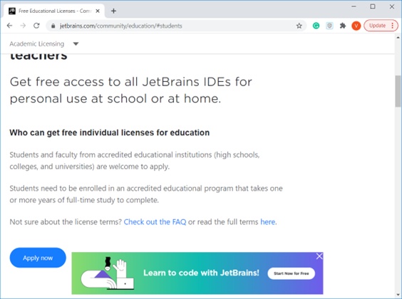

  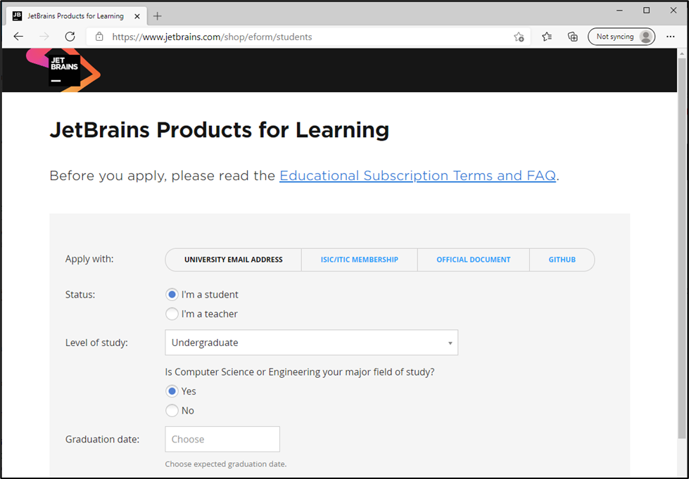

### Install and Set up CLion

* Once you have been approved, you can log in using the JB account you created.

    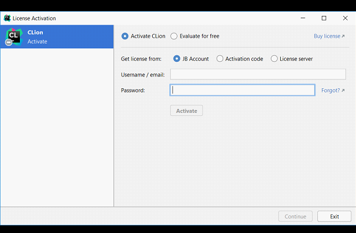

* When you first open CLion, you should have this welcome window. From here 
you can add your GitHub using **"Get from VCS"**.

* From here, you can add your GitHub credentials:

    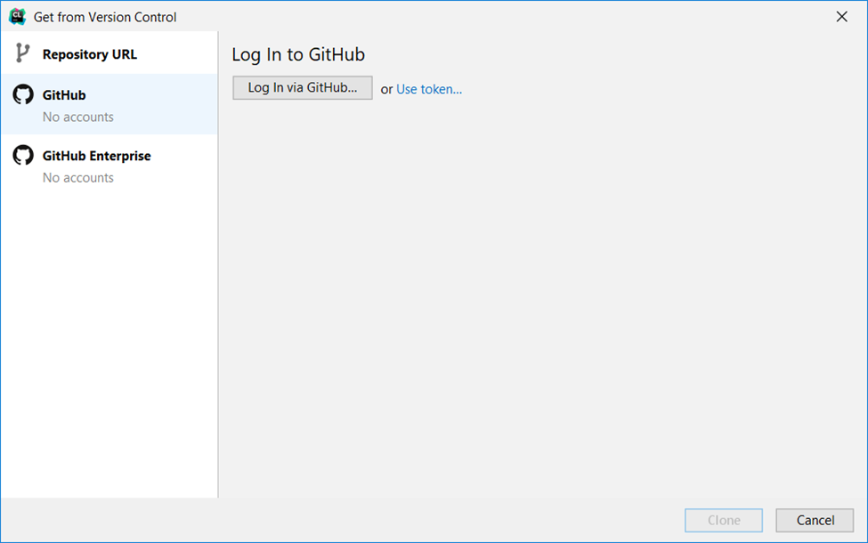

    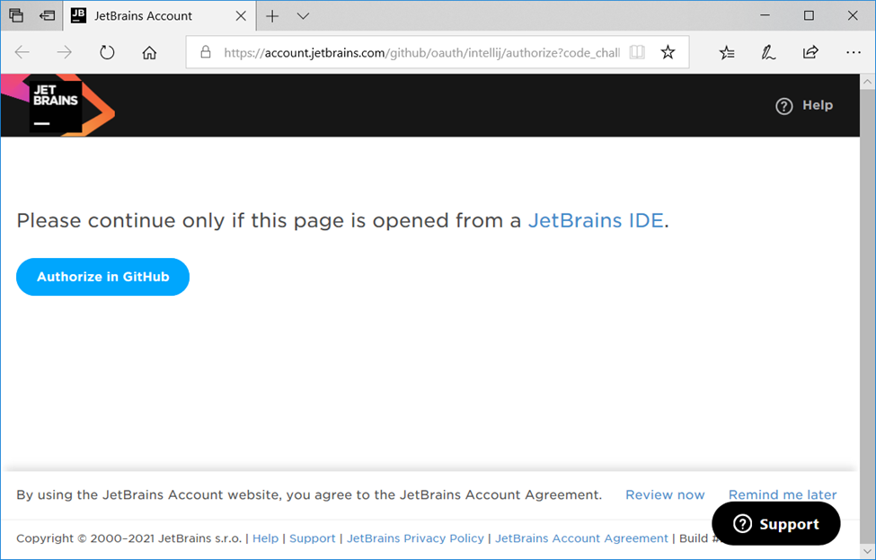

    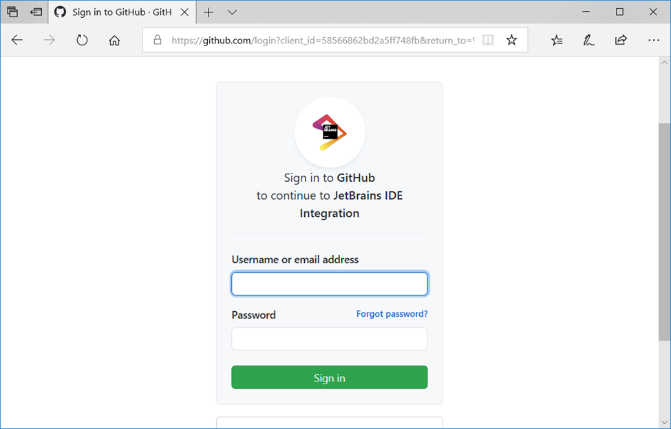

# Configuring the Compiler for MacOS

Next you will need to configure your compiler.

* [Windows Instructions](CLion%20Compiler%20Setup%20(Windows).md)
* [MacOS Instructions](CLion%20Compiler%20Setup%20(MacOS).md)

# Windows Only (Optional)

There is a small issue with printing where an extra space is printed the 
first instance you call `cout`.  This can be fixed using the following steps.

### Help &rarr; Find Action
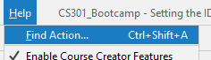

### Search for Registry
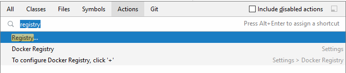

### Select run.processess.with.pty
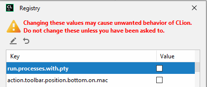

# Clone bootcamp repository
After you set up your IDE, you can now clone the bootcamp repository to your 
local machaine.

> ### Note
> You may need to install Git if you do not have this option.

* Click "Get from VCS"

  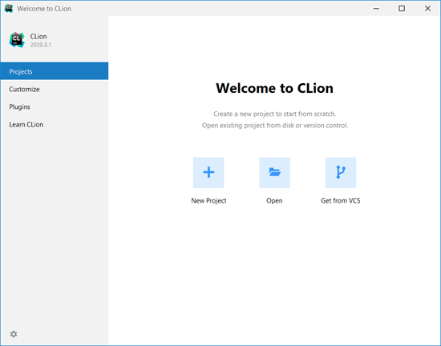

  Alternatively, you can also click **"File" &rarr; "New" &rarr; "Project from
  Version Control"**

  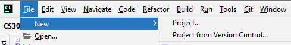
* From here you should be able to see all of your GitHub projects.  Click
  **Clone**.

  

* Click **"Ok"** after you see the following settings wizard prompt

  
