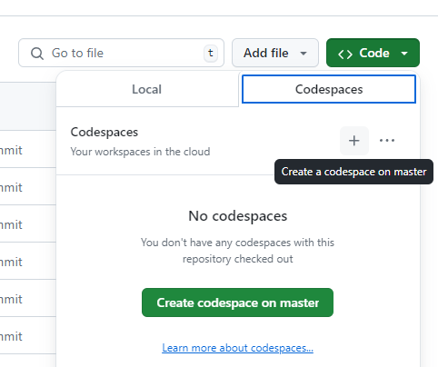
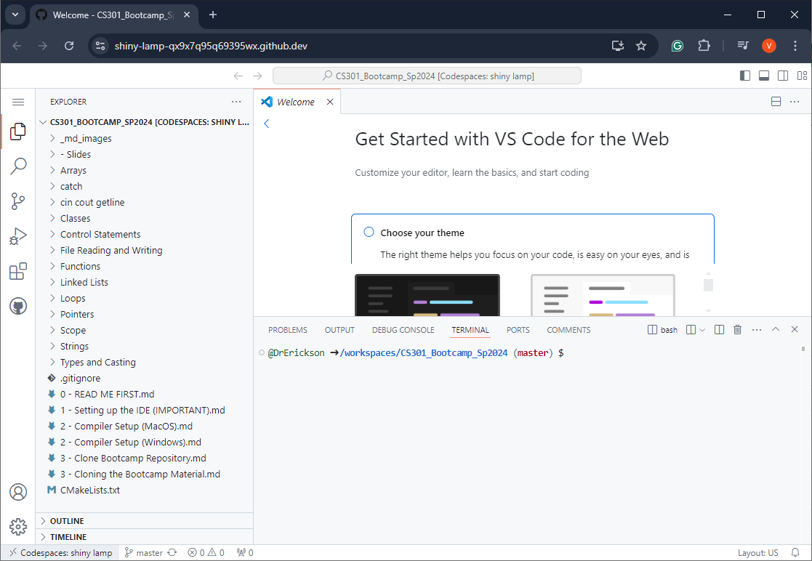
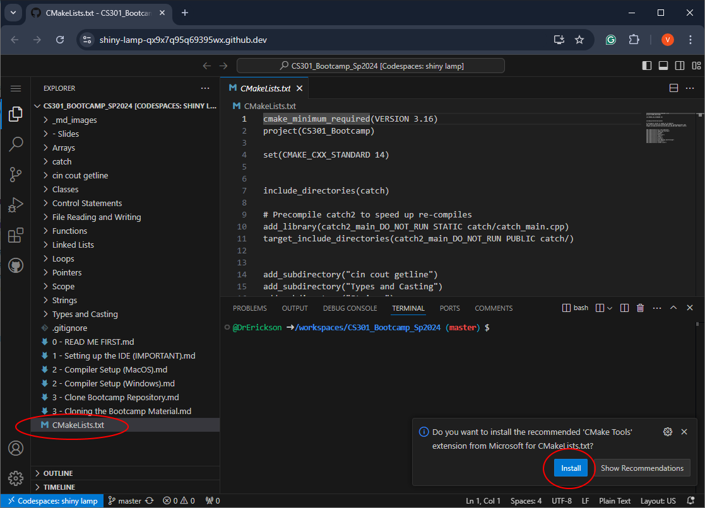
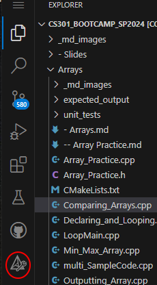
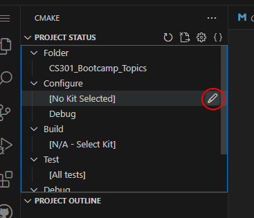
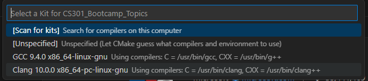
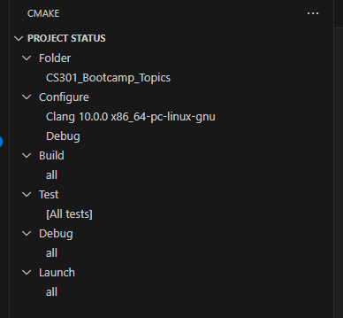
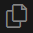
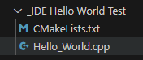
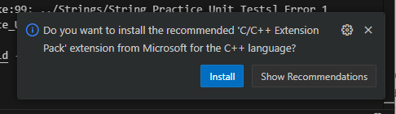

# NOTE
> Skip this guide if you are using CLion on your own machine during the
> bootcamp.
>
> You only need to reference this guide if you plan on using the computers
> in the lab during the bootcamp.

# Setting up VS Code IDE on Codespaces

This guide will show you how to run a cloud instance of Visual Studio Code 
(VS Code) using a GitHub feature called Codespaces.  This will allow you to 
edit and run code on VS Code within a browser window.

# Before you start

It would be helpful to make sure you have
a [GitHub account](https://github.com/signup) already created.

You can use either a personal or school email address with your GitHub account.

Once you have cloned the repository
(see [1 - Create a Bootcamp Repository](1%20-%20Create%20a%20Bootcamp%20Repository.md)),
click on

**"Code" &rarr; "Codespaces" &rarr; "+"**

This will open a new browser tab with a cloud instance of Visual Studio Code.

# Install CMake Tools Extension

You will need to install the CMake plugin for Visual Studio Code.  This 
plugin simplifies the compile and run process.

If you click on the CMakelist.txt file in the explorer, VS Code will prompt 
you to install the `CMake Tools` extension.  Click `Install` to install the 
CMake Tools extension.

After it is installed, click the CMake Tools icon on the left menu.

Click the  next to the `[No Kit Selected]`.  

Select the `Clang` compiler (your version of Clang may be different):

Your `CMake Tools` menu should now show `Clang` as your compiler.

> For more information about CMake and Visual Studio Code, you can also 
> check the following resource:
> 
> https://code.visualstudio.com/docs/cpp/cmake-linux

# Install C/C++ Extension Pack

The C/C++ Extension Pack provides VS Code the ability to autocomplete 
functions and highlight code.  

Click the `Explorer Icon`  on the left vertical menu. 
This will show you the all the folders and files of the bootcamp repository.

Open the `Hello_World.cpp` file under the `_IDE Hello World Test` folder.

When you open the file for the first VS Code will prompt you to install the 
extension.  Click `Install` to install the extension pack. 

# Testing your IDE

Next, test your IDE setup to make sure it is working properly using this guide.
* [Testing the VS Code IDE](3%20-%20Testing%20the%20VS%20Code%20IDE.md)