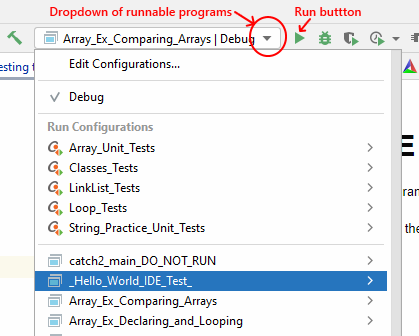
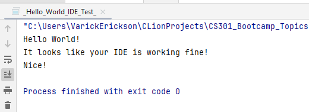

# Testing the CLion IDE

After you configure your IDE, you should test your IDE configuration by 
running the provided hello world program.

# Selecting the Hello World test Program
The bootcamp repository is made up many programs and has multiple main 
functions.  You must select the program you wish to run fom a dropdown menu 
on the upper right of the window.  Select the `_Hello_World_IDE_Test_` from 
the dropdown.  After selecting the `_Hello_World_IDE_Test_`,click the 
 button to run the test.

If your IDE is configured correctly, then the hello world program should 
print out the following at the bottom:

