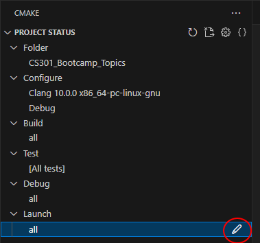
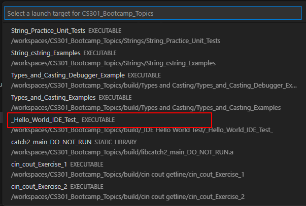
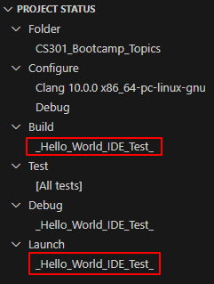
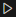
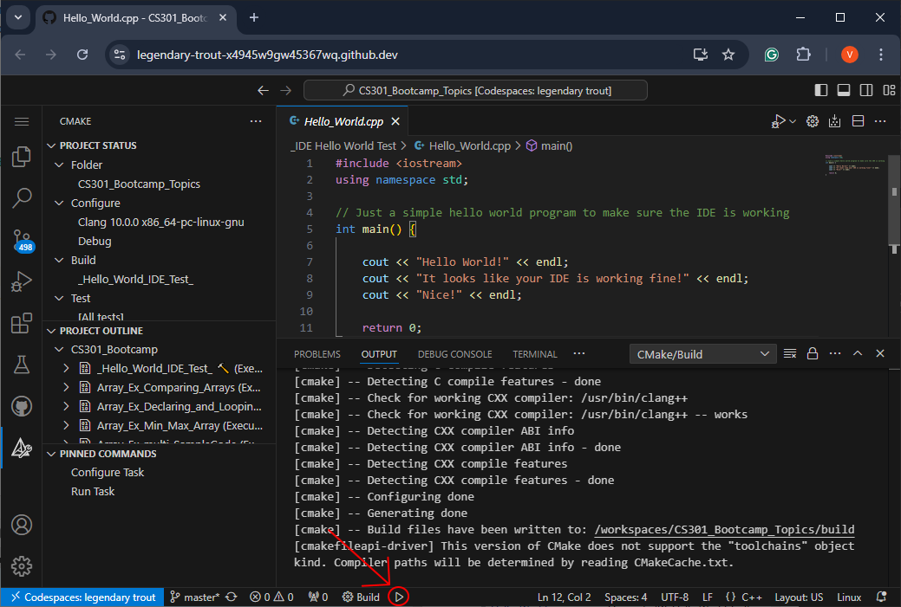
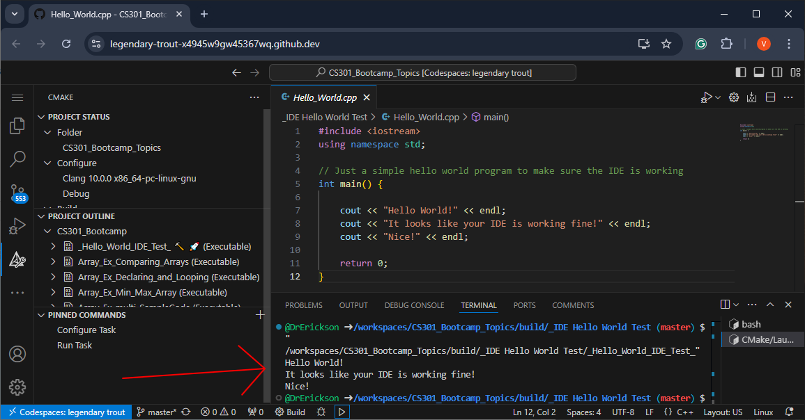

# Testing the VS Code IDE

After you configure your IDE, you should test your IDE configuration by
running the provided hello world program.

# Selecting the Hello World test Program
The bootcamp repository is made up many programs and has multiple main
functions.

Click the `CMake Tool`  button on the left vertical menu.

Under the `Launch` dropdown, you can select the program you wish to build.  
Click the  under the `Launch` and select 
`_Hello_World_IDE_Test_` from the list (you can also use the search bar at 
the top to more quickly find you desired target).

Do the same process to set the `Build` to `_Hello_World_IDE_Test_`.
Your `CMake Tool` menu should have `_Hello_World_IDE_Test_` selected as the 
build and launch target.

> **IMPORTANT:** 
> Make sure the `Build` and `Launch` are set to the same target.

After selecting the `_Hello_World_IDE_Test_`, click the 
 button at the bottom of the window to run the test.

If your IDE is configured correctly, then the hello world program should
print out the following at the bottom:

