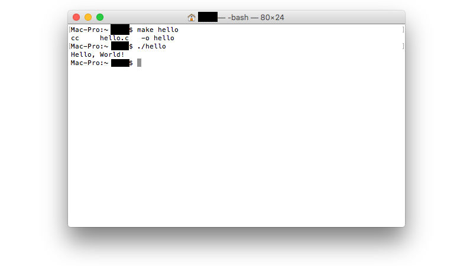
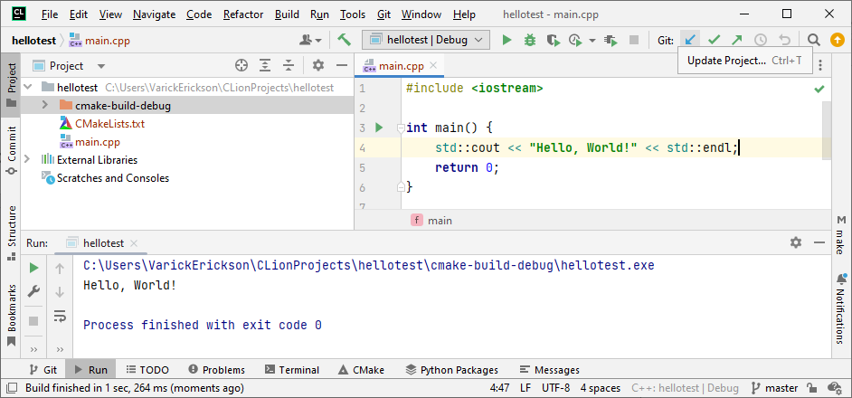
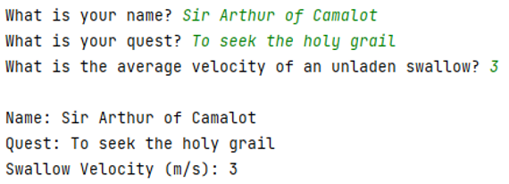
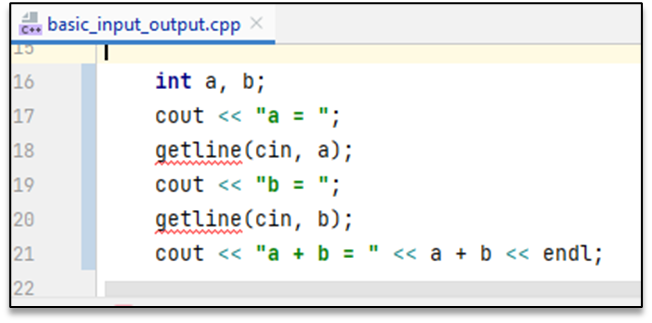
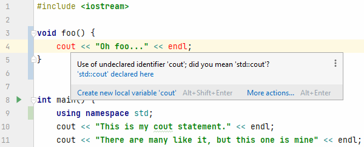

# Basic Input and Output
Written by Varick Erickson - &copy; Varick Erickson 2022

A terminal or console is one of the simplest and most often used method of 
interacting with a program.  If you are Windows, the powershell or cmd 
program 
can be used:  


If you are in MacOS or Linux, then you can use a Terminal window:



However, in most cases, if you are developing in an IDE like CLion, then a 
terminal will be made available to you directly in the IDE:



## #include \<iostream>

In order do basic input and output to the terminal, you will use the `iostream` 
library.  This library allows you to use input and output stream 
objects from the std library.

iostream &rarr; ***I***nput ***O***utput ***S***tream

```c++
#include <iostream>
```

### cout
The function `cout` allows you to output to the terminal.


The `endl` stands for "endline".  It moves the output to a new line.
You can achieve the same effect by using "\n" in the string as well.


>
> Notice that for `cout` we use `<<`.
> 
> The `<<` indicates the direction that information flows.  In this case, 
> data is flowing *from* the program *to* the terminal.
> 

### Escape Characters
There are certain characters that will require use an escape character in 
order to print the character to the terminal.  The " symbol is an example of 
such a symbol.  In order to print a ", we will use \". Escape characters 
will typically start with \.


>
> **Useful/Common Escape Characters**
> 
> * \n &rarr; newline
> * \t &rarr; tab
> * \\" &rarr; double quote
> * \\ &rarr; backslash
> 
> You can find a more complete list of escape characters here:
> https://en.cppreference.com/w/cpp/language/escape


### cin
The function `cin` allows you to receive input from the terminal.  In this 
example we prompt the user for their name and then store the result into the 
string variable `name`.

```c++
string name;
cout << "What is your name? ";
cin >> name;
```

The `cin` object will automatically convert the user input based on the 
variable type.  Note that the conversion only works for primitives (i.e. int, 
float, etc).  In the example below, since `speed` is an integer variable, 
`cin` will automatically convert the user input into an integer.

```c++
int speed;
cout << "What is the average velocity of an unladen swallow? ";
cin >> speed;
```
>
> Notice that for `cin` we use `>>`.
>
> In this case, data is flowing *from* the terminal *to* a variable.
>

### cin and multiple input
The `cin` object has the ability to read multiple inputs provided they are 
delimited by whitespace. Any input separated by whitespace will be treated as 
a distinct input and stored in the variable based on the order.

[//]: # (![img_6.png]&#40;img_6.png&#41;)

The following is an example of how we can use cin to input multiple values 
on the same line.
```c++
int x, y, z;
cout << "Enter x, y, z: ";
cin >> x;
cin >> y;
cin >> z;

cout << "x: " << x << endl;
cout << "y: " << y << endl;
cout << "z: " << z << endl;
```

If the user enters "4 5 6" on the same line, then `cin` will 
delimit the input into the values 4, 5, and 6 store each 
value into the x, y, and z variables in that order.
```
Enter x, y, z: 4 5 6
x: 4
y: 5
z: 6
```

Note that `cin` will automatically ignore all whitespace between inputs. 
```
Enter x, y, z: 4              5                       6
x: 4
y: 5
z: 6
```

Note that we could also rewrite the code as follows and the code would still 
have the same behavior.
```c++
int x, y, z;
cout << "Enter x, y, z: ";
cin >> x >> y >> z;  // We can also write the cin like this

// cin >> x;
// cin >> y;
// cin >> z;

cout << "x: " << x << endl;
cout << "y: " << y << endl;
cout << "z: " << z << endl;
```
## getline

One issue with `cin` is that it does not allow for inputs that 
contains whitespace.  For example, what if you wanted to input a first 
and last name and store that result into a single variable?

```c++
    int speed;
    string name, quest;
    cout << "What is your name? ";
    cin >> name;
    cout << "What is your quest? ";
    cin >> quest;
    cout << "What is the average velocity of an unladen swallow? ";
    cin >> speed;

    cout << endl;

    cout << "Name: " << name << endl;
    cout << "Quest: " << quest << endl;
    cout << "Swallow Velocity (m/s): " << speed << endl;
```


If we input "John Doe" for the name, we can see that `cin` splits "John" and 
"Doe" into two different inputs.  "John" gets stored into `name` and "Doe" 
get stored into `quest`.

In this case, the `getline` function would be more appropriate way to get 
input for the name and the quest.

```c++
    int speed;
    string name, quest;
    cout << "What is your name? ";
    getlin(cin, name);                  // getline instead of cin
    cout << "What is your quest? ";
    getline(cin, quest);                // getline instead of cin
    cout << "What is the average velocity of an unladen swallow? ";
    cin >> speed;

    cout << endl;

    cout << "Name: " << name << endl;
    cout << "Quest: " << quest << endl;
    cout << "Swallow Velocity (m/s): " << speed << endl;
```



Using `getline`, we are able to get multi-word answers from the user without 
using whitespace as a delimiter.

Note, however, that `getline` does NOT do automatic type conversion.  The 
`getline` function is only able to read input as strings.



This also means that `getline` is less flexible if you are trying to read 
primitives (int, float, etc).


Since we are reading a and b as strings, when we try to add the variables, 
the result just concats the values together rather than performing addition.

>
> ### TLDR: cin vs getline
> 
> If you need to get multi-word answers, then you should use `getline`.
> 
> If you want to get user input that are primitives (int, float, etc), then 
> you should use `cin` since it can do automatic type conversion.
> 
> In some situations, you may also find getline with a stringstream object 
> to be convenient.

# namespace

> ### **TLDR Version**
> 
> Make sure you put `using namespace std;` at the beginning of your program.
> 
> 

The functions `cout` and `cin` are part of the `std` namespace.  A 
namespace allows you to group a collection of functions or variables to 
avoid situations where you may accidentally have duplicate function names 
or variables.  For example, suppose you were using two different graphics 
libraries that each defines a `DrawCircle` function.  If you were to call 
`DrawCircle`, the compiler would not know which `DrawCircle` it should use.

```c++
#include "GraphLib.h"         // Suppose this library defines DrawCircle
#include "TwoDimGraphics.h"   // Suppose this library also defines another DrawCicle

// The compiler would get would not know which version of DrawCircle to use
DrawCicle(5, 5, 25);
```

In order for the compiler to know which version of `DrawCircle` to use, you 
would need to state the namespace to find `DrawCircle`.

```c++
#include "GraphLib.h"         // Suppose this library defines DrawCircle
#include "TwoDimGraphics.h"   // Suppose this library also defines another DrawCicle

GraphLib::DrawCicle(5, 5, 25);        // Call the GraphLib version of DrawCircle
TwoDimGraphics::DrawCicle(5, 5, 25);  // Call the TwoDimGraphics version of DrawCircle
```

Since `cout` and `cin` were written to be part of a namespace, we are 
required to explicitly tell the compiler what namespace to find `cout` and `cin`.

### std namespace
Notice that if we don't tell the compiler what namespace `cout` and `cin` live,
the compiler  views both functions as "undeclared" (i.e. it can't find 
definitions for these functions).


There are a few different ways to tell the compiler where to look.  The 
first is to put `std::` before the calls to `cout` and `cin`. Notice that 
`endl` also needs `std::` since `endl` is a constant that also "lives" in 
the `std` namespace. Also notice that the IDE also suggests this as a 
potential fix.


A more convenient way to let the compiler know ahead of time where `cout` and 
`cin` lives before we actually use `cout` and `cin`.  If we put 
`using namespace std;` at the beginning of the `main` function, we are 
telling the compiler that the `main` function is also part of the `std` 
namespace and the compiler will automatically look in the `std` namespace 
for functions for the duration of the `main`.


The disadvantage of the above approach is that the comopiler will only 
understand `cout` and `cin` in the `main` function.  If we try to use 
`cout` and `cin` in another function, it will again get confused.



To avoid this problem, a common strategy is to put `using namespace std;` at 
the beginning of the program.  The advantage of this approach this tells 
the compiler globally where to look for `cin` and `cout`.  In other words, 
the compiler will know about these `cin` and `cout` anywhere in the program 
code.


